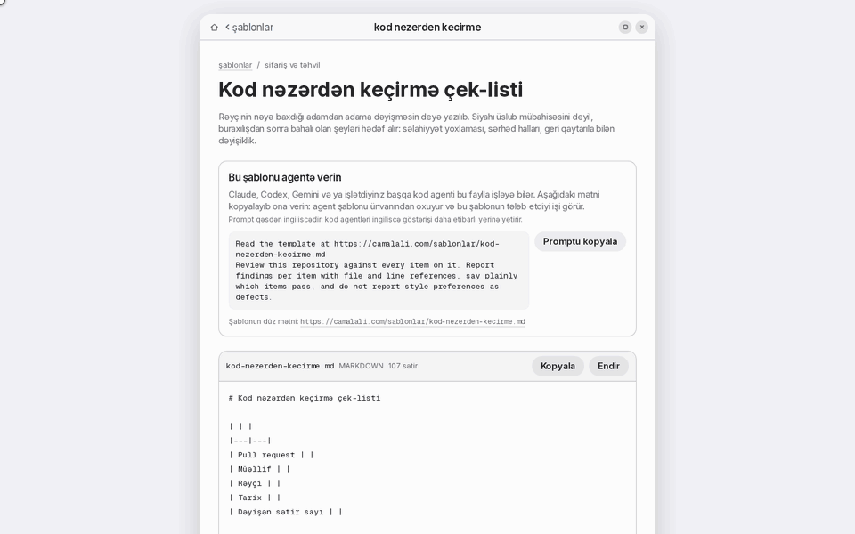
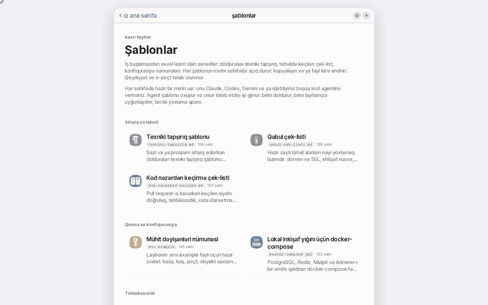

<a id="english"></a>

# agent-ready-templates

10 documents a software project has to produce anyway, packaged so a coding agent can act on them. Each one carries a single English instruction that says which job it is: fill this in, adapt this to the repository, or audit the project against it.

    

[Azərbaycanca oxu](#azerbaycanca)

## What this is

A brief before the build starts, a checklist before the handover, a compose file before the first `docker compose up`. These documents get written badly or not at all because nobody wants to start from an empty file, and an agent asked to "write a technical brief" invents a structure every time.

So the structure is fixed here, in 10 files across 4 categories and 4 formats (Markdown, YAML, INI, nginx), and each one is paired with the instruction it needs:

- **Fill in.** The brief, the incident report, the backup plan and the migration plan are questionnaires. The agent asks, you answer, it writes the finished document.
- **Adapt.** The compose file, the environment example and the CI workflow are starting points. The agent reads the repository and changes them to match what is actually there.
- **Audit.** The acceptance checklist, the code review list and the security headers are yardsticks. The agent measures a project against them and reports per item.

The template text is written in Azerbaijani. The instruction handed to the agent is English, and the document it produces follows whatever language you are working in.

## Quick start

**Take the file.** Every template is one plain document with no build step:

```bash
curl -O https://camalali.com/sablonlar/texniki-tapsiriq.md
```

The same file lives in this repository at [`templates/texniki-tapsiriq.md`](templates/texniki-tapsiriq.md), and `curl -O https://raw.githubusercontent.com/jamalkamaladdin/agent-ready-templates/main/templates/texniki-tapsiriq.md` fetches it from here instead.

**Hand it to an agent.** Paste this and nothing else:

```
Read the template at https://camalali.com/sablonlar/texniki-tapsiriq.md
Ask me its questions section by section, fill it in from my answers, and save the result as texniki-tapsiriq.md. Where I say I do not know, write that down instead of inventing an answer.
```

The ready prompt for every template is in [`index.json`](index.json) under `prompt`, so an agent can pick its own.

## Demo

<table>
<tr>
  <td width="50%"></td>
  <td width="50%"></td>
</tr>
</table>

## The templates

### Briefing and handover

| | Template | File | Lines | What the agent does with it |
|---|---|---|---|---|
|  | [Technical brief](templates/texniki-tapsiriq.md) | `texniki-tapsiriq.md` | 155 | Ask me its questions section by section, fill it in from my answers, and save the result as texniki-tapsiriq.md. Where I say I do not know, write that down instead of inventing an answer. |
|  | [Acceptance checklist](templates/qebul-cek-listi.md) | `qebul-cek-listi.md` | 136 | Check my site against every item on it. Ask me for the address and for anything you cannot verify yourself, then report each item as pass, fail or unverified, with the evidence you used. |
|  | [Code review checklist](templates/kod-nezerden-kecirme.md) | `kod-nezerden-kecirme.md` | 107 | Review this repository against every item on it. Report findings per item with file and line references, say plainly which items pass, and do not report style preferences as defects. |

### Setup and configuration

| | Template | File | Lines | What the agent does with it |
|---|---|---|---|---|
|  | [Environment file example](templates/env-numunesi.md) | `env.example` | 141 | Compare it with this project: keep the variables the code actually reads, add the ones that are missing, drop the rest. Write the result as .env.example with empty values and never put real secrets in it. |
|  | [Docker Compose for development](templates/docker-compose-dev.md) | `docker-compose.yml` | 123 | Adapt it to this project: keep only the services it needs and match the versions already in use. Write the result as docker-compose.yml and list what you changed and why. |

### Security

| | Template | File | Lines | What the agent does with it |
|---|---|---|---|---|
|  | [Security headers](templates/tehlukesizlik-basliqlari.md) | `tehlukesizlik-basliqlari.conf` | 108 | Work out which of its headers this project already sends and which are missing. Give me the configuration for the server this project actually runs, and warn me about any header that could break the site before I apply it. |
|  | [Database backup plan](templates/baza-ehtiyat-nusxe.md) | `baza-ehtiyat-nusxe.md` | 153 | Fill it in for this project. Ask me what the database is, where the backups go and how long they are kept, then write the completed document as baza-ehtiyat-nusxe.md with the restore steps spelled out. |

### Deploy and CI/CD

| | Template | File | Lines | What the agent does with it |
|---|---|---|---|---|
|  | [GitHub Actions CI workflow](templates/github-actions-ci.md) | `ci.yml` | 92 | Adapt it to this project: use the package manager, Node version and scripts this repository actually has. Write the result as .github/workflows/ci.yml and explain any step you dropped. |
|  | [Site migration plan](templates/sayt-kocurme-plani.md) | `sayt-kocurme-plani.md` | 198 | Fill it in for the move I am planning. Ask me where the site is now, where it is going and what has to keep working, then write the plan as sayt-kocurme-plani.md with the rollback steps filled in. |
|  | [Incident report](templates/hadise-hesabati.md) | `hadise-hesabati.md` | 132 | Fill it in for the incident I describe. Ask me for the timeline, the impact and what changed, then write the report as hadise-hesabati.md. Do not state a root cause I have not confirmed. |

## Use with any agent

A URL plus one sentence is the whole protocol. No tool name, no JSON envelope, no role preamble, because those are the parts that differ between products:

| Agent | Command |
|---|---|
| Claude Code | `claude "Read the template at https://camalali.com/sablonlar/texniki-tapsiriq.md and fill it in with me"` |
| Codex CLI | `codex "Read the template at https://camalali.com/sablonlar/texniki-tapsiriq.md and fill it in with me"` |
| Gemini CLI | `gemini -p "Read the template at https://camalali.com/sablonlar/texniki-tapsiriq.md and fill it in with me"` |

An agent that has to find the right template first can read [`index.json`](index.json) here, or the same listing live at [`https://camalali.com/api/sablonlar`](https://camalali.com/api/sablonlar). Both carry every template with its address, its line count and its prompt, so choosing costs one fetch rather than a crawl.

## Where these come from

They are written and kept at [https://camalali.com/sablonlar](https://camalali.com/sablonlar), and this repository is generated from that source. Hand edits made here are not kept: the next export overwrites them. Corrections and requests belong on the site.

## License

MIT, see [LICENSE](LICENSE). Use them at work, in a client project or in a product, with no attribution required.

---

<a id="azerbaycanca"></a>

# agent-ready-templates (Azərbaycanca)

Layihənin onsuz da hazırlamalı olduğu 10 sənəd, kodlaşdıran agentin işləyə biləcəyi formada. Hər faylın yanında bir ingilis cümləsi var və o cümlə işin hansı növ olduğunu deyir: bunu doldur, bunu layihəyə uyğunlaşdır, ya da layihəni bununla yoxla.

    

[Read in English](#english)

## Bu nədir

İş başlamazdan əvvəl texniki tapşırıq, təhvildən əvvəl qəbul çek-listi, ilk `docker compose up` əmrindən əvvəl compose faylı. Bu sənədlər ya pis yazılır, ya heç yazılmır, çünki boş fayldan başlamaq istəyi olmur. «Texniki tapşırıq yaz» deyilən agent isə hər dəfə yeni bir quruluş uydurur.

Ona görə quruluş burada sabitdir: 4 kateqoriyada 10 fayl, 4 format (Markdown, YAML, INI, nginx). Hər faylın öz göstərişi var:

- **Doldurulan.** Texniki tapşırıq, hadisə hesabatı, ehtiyat nüsxə planı və köçürmə planı sual siyahısıdır. Agent soruşur, sən cavab verirsən, o hazır sənədi yazır.
- **Uyğunlaşdırılan.** Compose faylı, mühit dəyişənləri nümunəsi və CI axını başlanğıc nöqtəsidir. Agent repozitoriyanı oxuyur və faylı orada həqiqətən olana görə dəyişir.
- **Yoxlayan.** Qəbul çek-listi, kod nəzərdən keçirmə siyahısı və təhlükəsizlik başlıqları ölçü cədvəlidir. Agent layihəni onlarla tutuşdurur və hər bənd üzrə nəticə verir.

Şablonların mətni azərbaycancadır. Agentə verilən göstəriş ingiliscədir, çıxan sənəd isə sənin işlədiyin dildə olur.

## Sürətli başlanğıc

**Faylı götür.** Hər şablon adi bir sənəddir, heç bir quraşdırma tələb etmir:

```bash
curl -O https://camalali.com/sablonlar/texniki-tapsiriq.md
```

Eyni fayl bu repozitoriyada da var: [`templates/texniki-tapsiriq.md`](templates/texniki-tapsiriq.md). Buradan götürmək üçün: `curl -O https://raw.githubusercontent.com/jamalkamaladdin/agent-ready-templates/main/templates/texniki-tapsiriq.md`

**Agentə ver.** Yalnız bunu yapışdır:

```
Read the template at https://camalali.com/sablonlar/texniki-tapsiriq.md
Ask me its questions section by section, fill it in from my answers, and save the result as texniki-tapsiriq.md. Where I say I do not know, write that down instead of inventing an answer.
```

Hər şablonun hazır promptu [`index.json`](index.json) faylında `prompt` sahəsindədir, agent özü seçə bilər.

## Demo

<table>
<tr>
  <td width="50%"></td>
  <td width="50%"></td>
</tr>
</table>

## Şablonlar

### Sifariş və təhvil

| | Şablon | Fayl | Sətir | Agent onunla nə edir |
|---|---|---|---|---|
|  | [Texniki tapşırıq şablonu](templates/texniki-tapsiriq.md) | `texniki-tapsiriq.md` | 155 | Ask me its questions section by section, fill it in from my answers, and save the result as texniki-tapsiriq.md. Where I say I do not know, write that down instead of inventing an answer. |
|  | [Qəbul çek-listi](templates/qebul-cek-listi.md) | `qebul-cek-listi.md` | 136 | Check my site against every item on it. Ask me for the address and for anything you cannot verify yourself, then report each item as pass, fail or unverified, with the evidence you used. |
|  | [Kod nəzərdən keçirmə çek-listi](templates/kod-nezerden-kecirme.md) | `kod-nezerden-kecirme.md` | 107 | Review this repository against every item on it. Report findings per item with file and line references, say plainly which items pass, and do not report style preferences as defects. |

### Qurma və konfiqurasiya

| | Şablon | Fayl | Sətir | Agent onunla nə edir |
|---|---|---|---|---|
|  | [Mühit dəyişənləri nümunəsi](templates/env-numunesi.md) | `env.example` | 141 | Compare it with this project: keep the variables the code actually reads, add the ones that are missing, drop the rest. Write the result as .env.example with empty values and never put real secrets in it. |
|  | [Lokal inkişaf yığını üçün docker-compose](templates/docker-compose-dev.md) | `docker-compose.yml` | 123 | Adapt it to this project: keep only the services it needs and match the versions already in use. Write the result as docker-compose.yml and list what you changed and why. |

### Təhlükəsizlik

| | Şablon | Fayl | Sətir | Agent onunla nə edir |
|---|---|---|---|---|
|  | [HTTP təhlükəsizlik başlıqları](templates/tehlukesizlik-basliqlari.md) | `tehlukesizlik-basliqlari.conf` | 108 | Work out which of its headers this project already sends and which are missing. Give me the configuration for the server this project actually runs, and warn me about any header that could break the site before I apply it. |
|  | [Ehtiyat nüsxə və bərpa qaydası](templates/baza-ehtiyat-nusxe.md) | `baza-ehtiyat-nusxe.md` | 153 | Fill it in for this project. Ask me what the database is, where the backups go and how long they are kept, then write the completed document as baza-ehtiyat-nusxe.md with the restore steps spelled out. |

### Deploy və CI/CD

| | Şablon | Fayl | Sətir | Agent onunla nə edir |
|---|---|---|---|---|
|  | [GitHub Actions CI (Node.js)](templates/github-actions-ci.md) | `ci.yml` | 92 | Adapt it to this project: use the package manager, Node version and scripts this repository actually has. Write the result as .github/workflows/ci.yml and explain any step you dropped. |
|  | [Sayt köçürmə planı](templates/sayt-kocurme-plani.md) | `sayt-kocurme-plani.md` | 198 | Fill it in for the move I am planning. Ask me where the site is now, where it is going and what has to keep working, then write the plan as sayt-kocurme-plani.md with the rollback steps filled in. |
|  | [Hadisə hesabatı (postmortem)](templates/hadise-hesabati.md) | `hadise-hesabati.md` | 132 | Fill it in for the incident I describe. Ask me for the timeline, the impact and what changed, then write the report as hadise-hesabati.md. Do not state a root cause I have not confirmed. |

## İstənilən agentlə

Bir ünvan və bir cümlə, protokol bundan ibarətdir. Alət adı, JSON zərfi və ya rol mətni yoxdur, çünki məhsuldan məhsula dəyişən hissə məhz onlardır:

| Agent | Əmr |
|---|---|
| Claude Code | `claude "Read the template at https://camalali.com/sablonlar/texniki-tapsiriq.md and fill it in with me"` |
| Codex CLI | `codex "Read the template at https://camalali.com/sablonlar/texniki-tapsiriq.md and fill it in with me"` |
| Gemini CLI | `gemini -p "Read the template at https://camalali.com/sablonlar/texniki-tapsiriq.md and fill it in with me"` |

Əvvəlcə uyğun şablonu tapmalı olan agent buradakı [`index.json`](index.json) faylını, ya da canlı siyahını oxuya bilər: [`https://camalali.com/api/sablonlar`](https://camalali.com/api/sablonlar). Hər ikisində şablonun ünvanı, sətir sayı və promptu var, ona görə seçim bir sorğuya başa gəlir.

## Mənbə

Şablonlar [https://camalali.com/sablonlar](https://camalali.com/sablonlar) ünvanında yazılır və saxlanılır; bu repozitoriya həmin mənbədən generasiya olunur. Burada əl ilə edilən düzəliş saxlanmır, növbəti ixrac onu silir. Düzəliş və təklif əsas sayta göndərilir.

## Lisenziya

MIT, [LICENSE](LICENSE) faylına bax. İşdə, müştəri layihəsində və məhsulda işlətmək olar, istinad tələb olunmur.
